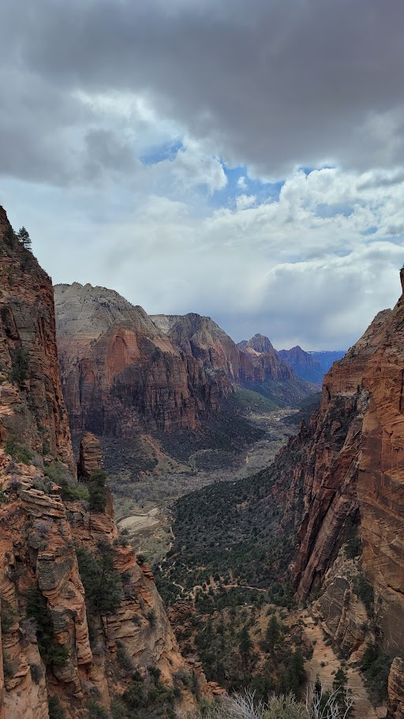
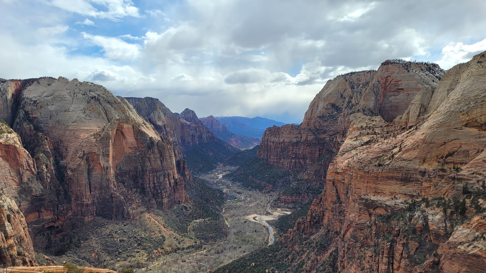
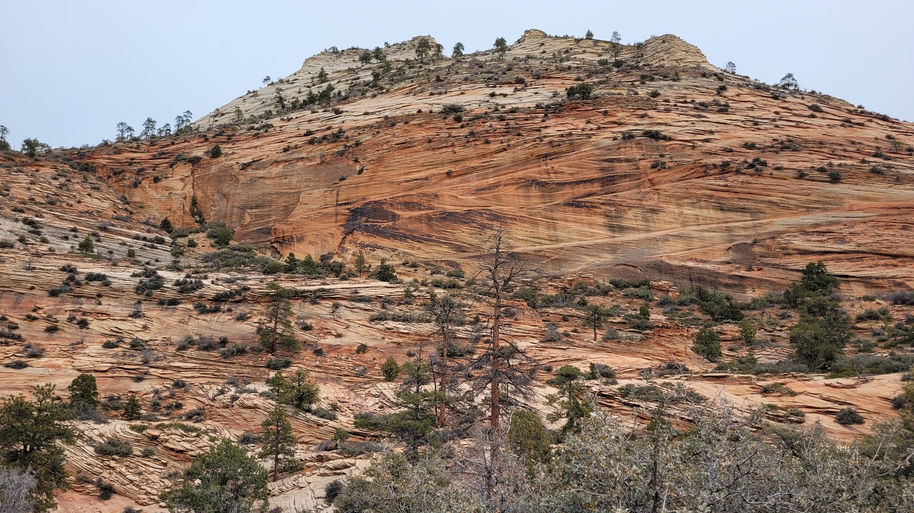
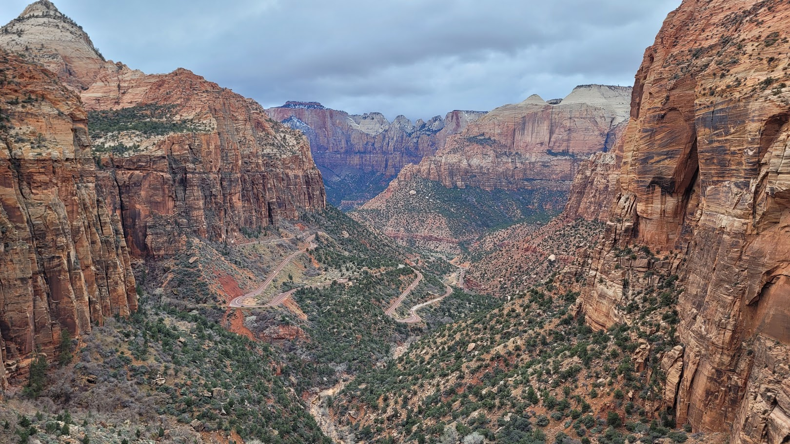
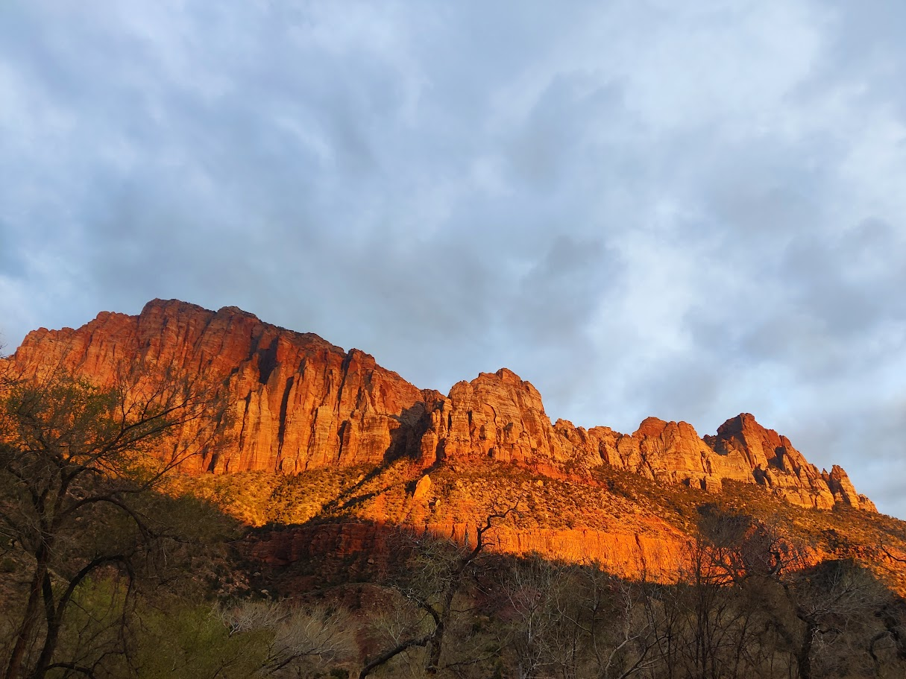
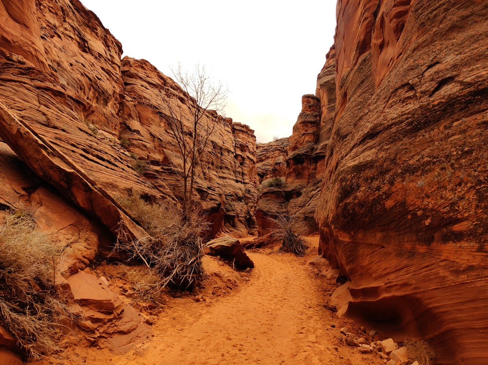
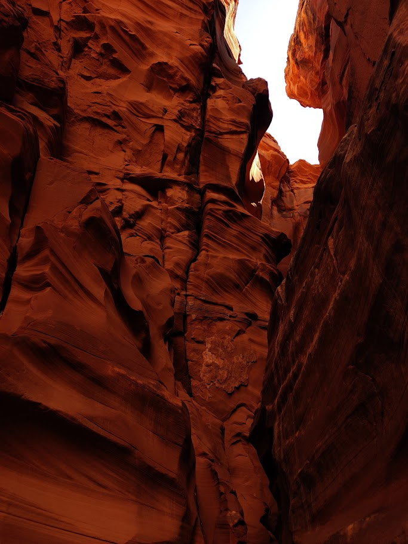
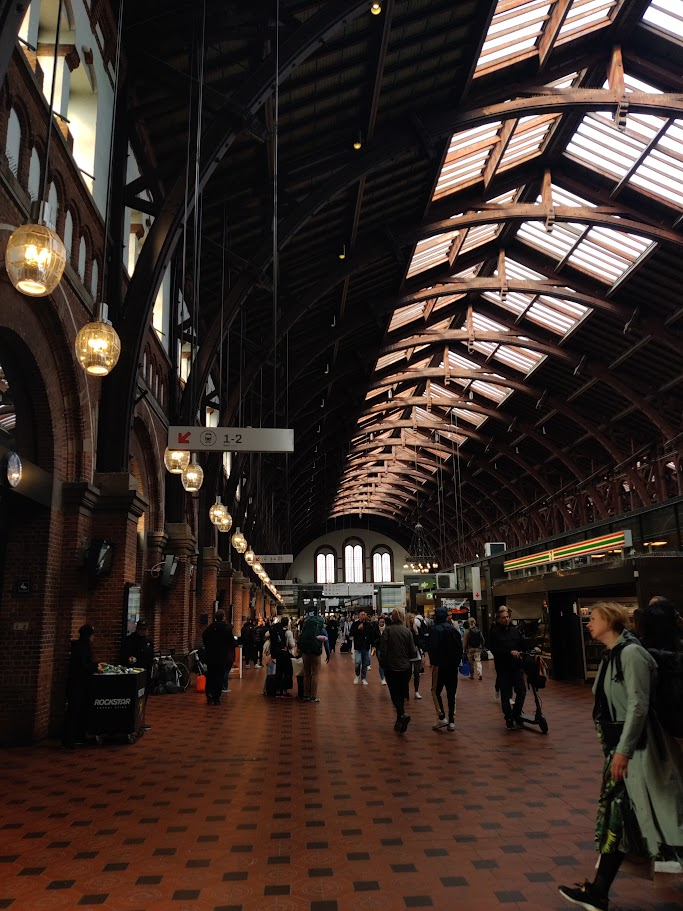
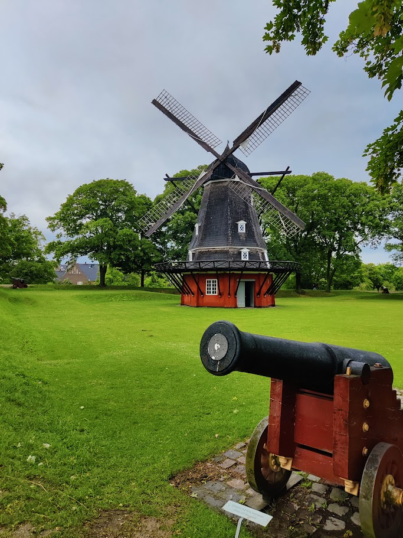
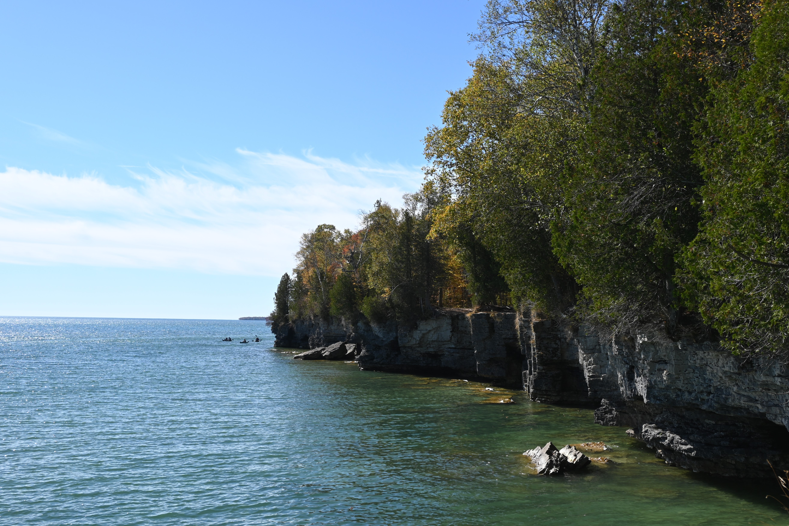

G4 storm near Purdue University.

Angels Landing trail, Zion National Park, March (2024)

Angels Landing trail, Zion National Park, March (2024)

 Zion National Park, March (2024)

Angels Landing trail, Zion National Park, March (2024)

 Zion National Park, March (2024)

Antelope Canyon X, March (2024)

Antelope Canyon X, March (2024)

Local train in Denmark, June (2024)

Copenhagen Central Station, June (2024)

Kastellet, Copenhagen, June (2024)

G4 storm near Purdue University.

Part of a full moon in August (2024).

Autumn in October (2024).

4th of July (2024).

Potawatomi state park (2024).

Cave Point County Park (2024)

